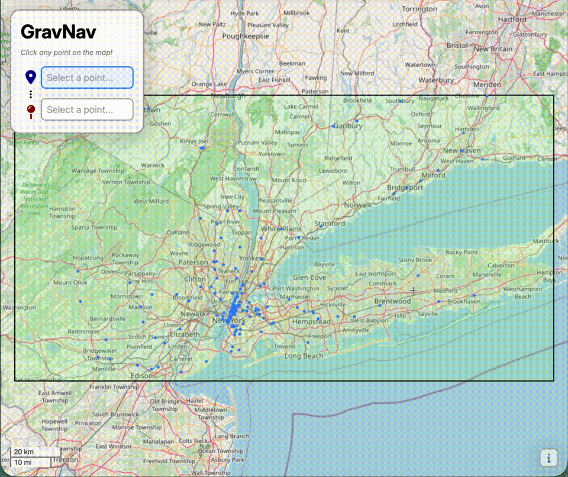

# Gravnav
*maximize burritos*




You can play around with GravNav at **[ommehta16.github.io/gravnav](https://ommehta16.github.io/gravnav)**: just click two points, wait for a route, then explore!

## What is GravNav?

A little project I've been working on!

Uses A* graph traversal, the [OpenStreetMap Overpass API](https://wiki.openstreetmap.org/wiki/Overpass_API), express.js, hopes, dreams, and an INCREDIBLE amount of duct tape to show you driving routes that get "subtly" attracted to nearby Chipotles


## Running GravNav

As is, you just need to open [`index.html`](/index.html) in your browser of choice. By default, the app's configured to use *my* droplet ([api.gravnav.ommehta.us](https://api.gravnav.ommehta.us/hello)) to find, process, cache, and send map data.

If opening `index.html` doesn't cause chunks to start loading, it's likely because your browser/computer is being *silly* (or just has extra, non-standard protections in place for straight html files!).

In this case, I've included [`silly-server.py`](/silly-server.py). If you'd like to run it this way, ensure that you have Python>3.13. Then run:
```bash
python3 -m pip install flask
python3 silly-server.py
```

Then you should be able to load gravnav on [`localhost:3000`](http://localhost:3000)

### Self-hosting

The backend is just a single, simple(ish) express.js server. I have it set up on a 2GB DigitalOcean droplet, but really any machine with >1GB of RAM should be able to handle it.

To run it, ensure you have node.js>24 and npm>11.8.0 installed, then
```bash
npm i; node server.js;
```
You can then quit the server with ^C, and force quit it with another ^C!

If you'd like to run it in a production-y environment, I'd recommend using [pm2](https://pm2.keymetrics.io). Check out [their docs](https://pm2.keymetrics.io/docs/usage/quick-start/) for more information on using it!

You can also get set up with a remote proxy! The nginx config for the server is in [`/nginx/gravnav.conf`](/nginx/gravnav.conf); just include it in your main `nginx.conf` file, change it to your needs, start nginx, and you should be good to go!

-----
In any case, though, if you're self-hosting, you'll need to **change the backend URL in `getdata.js`**. Just set `OSM_API_URL` to the url of your server, and you're good to go!


## How does it work?

On the server side,
 - Get road + Chipotle data from OSM OverpassAPI for new tiles
 - Simplify road graph (--> ~10% of nodes)
 - Store road graph

\
When the client is initially loading, it:
 - Floodfills to find the order to load chunks in
 - Fetches chunk data from server
 - Merges new data from chunk with existing data (resolve common nodes/intersection conflicts)
 - Calculate new timespans for each road segment

\
And after we've gotten user input,
 - Find the closest node to the click point
 - Run regular A* on the graph for the closest route
 - Run A* with [modified potentials](./src/mapData.js#L192) for the "Chipotle-est" route

<small>*Thanks for reading this far! This project has been so fun to write over the past month-and-a-half :)*</small>